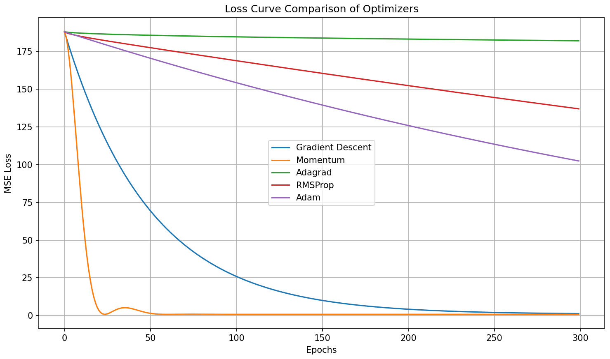

## 🔁 Optimizer Comparison

This experiment compares 5 optimization algorithms implemented from scratch:

- Gradient Descent
- Momentum
- Adagrad
- RMSProp
- Adam

### 🔍 Key Observations

- **Momentum** outperformed all others, reaching near-zero loss quickly.
- **Adagrad** slowed down too early due to aggressive learning rate decay.
- **Adam** was stable but slower, likely due to hyperparameter defaults.
- **Gradient Descent** was reliable but slowest overall.
- **RMSProp** struck a balance but didn't outperform Momentum.

### 📉 Loss Curve

