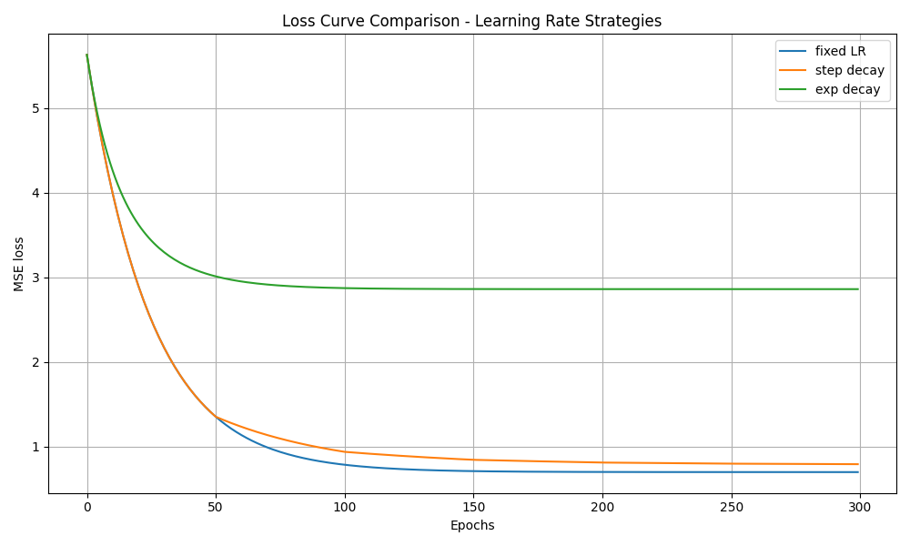

## 📅 Day 2: Learning Rate Scheduling with Real-World Data

### 🧪 Experiment Overview
- Dataset: California Housing (1 feature: Median Income)
- Optimizer: Gradient Descent (custom implementation)
- Strategies compared:
  - Fixed Learning Rate
  - Step Decay
  - Exponential Decay

### 📊 Observations
- **Fixed LR**: Performed best with smooth and steady loss reduction.
- **Step Decay**: Converged quickly early on, then plateaued due to aggressive drops.
- **Exp Decay**: Dropped too fast, leading to poor final convergence.

### 🧠 Reflection
Learning rate scheduling can be powerful when working with complex or uneven datasets — it dynamically adjusts the learning rate, allowing better convergence when the loss landscape varies (e.g., sparse or noisy features).

In this experiment, the fixed learning rate outperformed step decay and exponential decay. Since our dataset was relatively simple, clean, and normalized, decaying the learning rate too early caused slower convergence. This shows that learning rate strategies must be tuned according to the data's nature and complexity.

### 📉 Loss Curve

