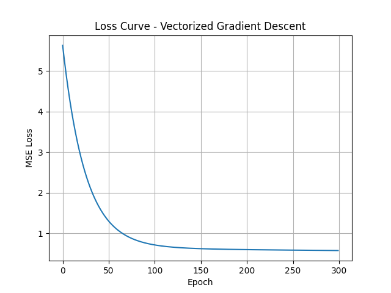

# 📘 Day 3: Vectorized Gradient Descent - Multi-Feature Linear Regression

This project implements multivariate linear regression using **vectorized gradient descent** from scratch in NumPy, trained on the California Housing dataset.

---

## 🧠 Objectives

- ✅ Implement linear regression with multiple features
- ✅ Use **vectorized operations** for efficiency
- ✅ Learn bias via explicit bias column
- ✅ Compare with scikit-learn's `LinearRegression`

---

## 📊 Dataset: California Housing
- Source: `sklearn.datasets.fetch_california_housing()`
- Features: 8 (e.g., MedInc, AveRooms, etc.)
- Target: Median house value

---

## ⚙️ Implementation Highlights

- Input features normalized using `StandardScaler`
- Bias term added by appending a column of 1s to `X`
- Optimized loss: Mean Squared Error (MSE)
- Gradient computed using: (2/n) * Xᵀ (Xw - y)

---

## 📉 Loss Curve



- Loss decreases steadily
- Model converges by ~250 epochs

---

## 🧪 Comparison with Scikit-Learn

| Component       | Scikit-learn | Ours (Vectorized GD) |
|----------------|--------------|----------------------|
| Sample Coeff   | 0.854        | 0.802                |
| Bias Term      | 2.0719       | 2.0671               |

✅ Results are close to analytical solution (LS), confirming correct implementation.

---

## 📦 Dependencies

```bash
numpy
matplotlib
scikit-learn
